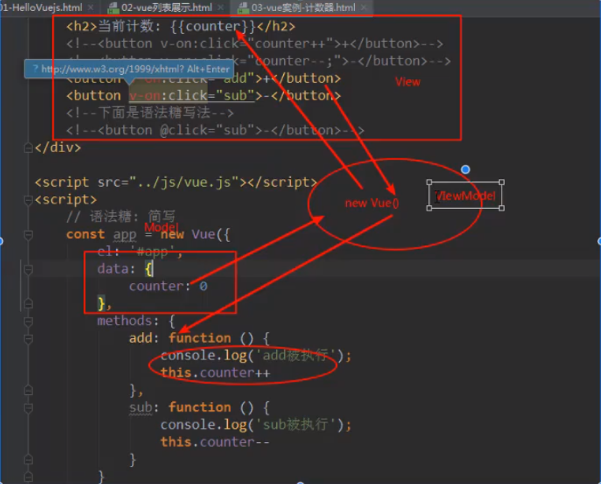

# VueLearn
## day01
### 属性
- el : 管理挂载
- data : 用于放置数据
- methods : 用于在Vue对象中定义方法
### 指令
- @click : 监听某个元素的点击事件，并需要指定被点击时执行的方法。(方法通常在methods中定义)

### MVVM(Model View ViewModel)



### 生命周期

### 插值操作

``` javascript
<div id="app">
    {{message}}
</div>
```

- v-once
    不会根据数据的改变而改变；后面不跟任何表达式。(不常用)
- v-html
    ```html
    <div id="app1">
      <h2 v-html="url"></h2>
    </div>

    const app1 = new Vue({
      el: '#app1',
      data: {
        message: 'hello world',
        url: '<a href="http://www.baidu.com">百度一下</a>'
      }
    })
    ```
- v-text
    不够灵活，会覆盖掉标签内的内容